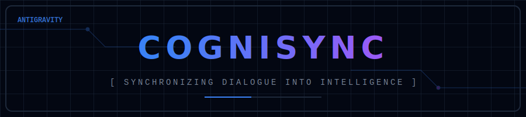

<p align="center">
  
</p>

<p align="center">
  <a href="LICENSE">
    
  </a>
  
</p>

# CogniSync 🧠⚙️

**CogniSync** is an autonomous background daemon designed to act as your local "Second Brain." It continuously monitors conversation logs in real-time, extracts valuable knowledge, context, and solutions using an AI-driven pipeline, and meticulously organizes them into a strictly structured knowledge base.


---

## 🚀 Features

- **Real-Time Monitoring:** Utilizes `watchdog` to silently observe conversation logs in the background.
- **Data Masking:** Automatically redacts sensitive credentials (API keys, tokens) before processing.
- **4-Pass Cognitive Pipeline:**
  1. **Compress:** Filters out noise from raw dialogue and creates dense summaries.
  2. **Extract:** Parallely extracts actionable context (memories) and problem-solution pairs.
  3. **Slug Match:** Intelligently matches extracted data against existing Knowledge Items (KIs) using deterministic logic.
  4. **Consolidate:** Uses AI to merge new information into existing KIs, avoiding duplication.

---

## 📂 Architecture & Directory Structure

```
CogniSync/
├── data/               # Persistent data (e.g., state.json)
├── logs/               # Application logs (daemon.log)
├── prompts/            # LLM Prompt templates for pipeline passes
├── tests/              # Unit tests (Pytest)
├── src/
│   ├── config/         # Foundation: paths, settings, .env, and unified logger
│   ├── core/           # Domain Logic: state management and text preprocessing
│   ├── helpers/        # Utilities: masking, detection
│   ├── providers/      # Integrations: OpenAI-compatible LLM wrapper
│   ├── schema/         # Data Contracts: Pydantic models
│   └── services/       # Use Cases: 4-Pass Pipeline, Watcher, Orchestration
├── main.py             # CLI Entry Point
├── .env.example        # Environment template
└── README.md           # Documentation
```

---

## 🛠️ Installation & Setup

**1. Clone the repository and navigate to the directory:**
```bash
git clone https://github.com/mdnaimul22/CogniSync.git
cd CogniSync
```

**2. Configure the Environment:**
Create a `.env` file in the root directory. CogniSync supports **Universal Path Resolution** (using `~` for home directory expansion).

```dotenv
APP_ENV=development

# LLM Configuration
LLM_BASE_URL=http://<YOUR_LLM_HOST>/v1
LLM_MODEL=CohereForAI_C4AI_Command
LLM_API_KEY=your_api_key_here
LLM_TEMPERATURE=0.3
LLM_MAX_TOKENS=4000

# Daemon Paths (Supports tilde expansion)
BRAIN_DIR=~/.gemini/antigravity/brain
KNOWLEDGE_DIR=~/.gemini/antigravity/knowledge
```


---

## 💻 Usage

CogniSync provides a clean CLI interface via `main.py`.

### 1. Start the Background Daemon
To run the watcher continuously in the background, it is recommended to use `screen`:

```bash
# Start in a detached screen session
screen -dmS cognisync python3 main.py watch

# Reattach to view logs
screen -r cognisync
```

### 2. Run Once
To process all pending buffered logs and immediately exit (useful for cron jobs):
```bash
python3 main.py watch --once
```

### 3. Force Process a Specific Conversation
If you want to manually process a conversation that was skipped or failed:
```bash
# Usage: python3 main.py process <conv_id>
python3 main.py process 28704b99-d2ff-48d5-b424-b89222e1781b
```

### 4. Check System Status
View current system health, loaded models, and knowledge tracking statistics:
```bash
python3 main.py status
```

---

## 🧪 Testing

The project is fully covered by robust unit tests. To run the test suite:
```bash
pytest tests/ -v
```

---

*“Precision is not an accident; it is the deliberate application of strict standards.”*
